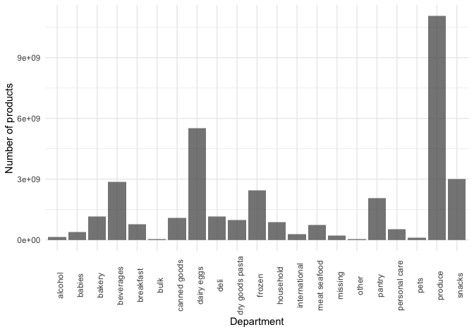

p8105\_hw3\_kb3066
================
Kaila Boyer
10/14/2021

``` r
library(tidyverse)
```

    ## ── Attaching packages ─────────────────────────────────────── tidyverse 1.3.1 ──

    ## ✓ ggplot2 3.3.5     ✓ purrr   0.3.4
    ## ✓ tibble  3.1.4     ✓ dplyr   1.0.7
    ## ✓ tidyr   1.1.3     ✓ stringr 1.4.0
    ## ✓ readr   2.0.1     ✓ forcats 0.5.1

    ## ── Conflicts ────────────────────────────────────────── tidyverse_conflicts() ──
    ## x dplyr::filter() masks stats::filter()
    ## x dplyr::lag()    masks stats::lag()

``` r
library(p8105.datasets)
library(patchwork)
```

## Problem 1

The goal is to do some exploration of this dataset. To that end, write a
short description of the dataset, noting the size and structure of the
data, describing some key variables, and giving illstrative examples of
observations. Then, do or answer the following (commenting on the
results of each):

How many aisles are there, and which aisles are the most items ordered
from?

``` r
data("instacart")

instacart %>% summarize(n_aisles = n_distinct(aisle_id))
```

    ## # A tibble: 1 × 1
    ##   n_aisles
    ##      <int>
    ## 1      134

``` r
instacart %>% select(aisle_id, product_id, aisle) %>% 
  group_by(aisle, aisle_id) %>% count() %>% 
  arrange(desc(n)) 
```

    ## # A tibble: 134 × 3
    ## # Groups:   aisle, aisle_id [134]
    ##    aisle                         aisle_id      n
    ##    <chr>                            <int>  <int>
    ##  1 fresh vegetables                    83 150609
    ##  2 fresh fruits                        24 150473
    ##  3 packaged vegetables fruits         123  78493
    ##  4 yogurt                             120  55240
    ##  5 packaged cheese                     21  41699
    ##  6 water seltzer sparkling water      115  36617
    ##  7 milk                                84  32644
    ##  8 chips pretzels                     107  31269
    ##  9 soy lactosefree                     91  26240
    ## 10 bread                              112  23635
    ## # … with 124 more rows

``` r
  instacart %>%  
    summarise( avg_prod_num = mean(order_number, na.rm = T), 
               total_users = n_distinct(user_id), 
               deptartments = n_distinct(department_id)) 
```

    ## # A tibble: 1 × 3
    ##   avg_prod_num total_users deptartments
    ##          <dbl>       <int>        <int>
    ## 1         17.1      131209           21

``` r
  instacart %>%  
  ggplot(aes(x = department, product_id)) + 
  geom_col() + 
  labs( 
      y = "Number of products", 
      x = "Department") + 
  theme(axis.text.x = element_text(angle = 90)) 
```


There are 134 unique aisles. The aisles with the most items ordered are
83 and 24 with over 150,000 items (fresh vegetables and fresh fruits).

There average number of products in an order is 17.1, there are 21
departments, and 131,209 users in the dataset.

The bar graph shows the number of products in each department.

Make a plot that shows the number of items ordered in each aisle,
limiting this to aisles with more than 10000 items ordered. Arrange
aisles sensibly, and organize your plot so others can read it.

``` r
instacart %>% 
  group_by(aisle) %>% count() %>% 
  arrange(desc(n)) %>% 
  filter(n >10000) %>% 
  transform(aisle = reorder(aisle, order(n, decreasing =F))) %>% 
  ggplot(aes(x = aisle, y = n)) + 
  geom_col(fill = "dark green") + 
  coord_flip() + 
  labs(
    title = "Number of Items in Aisles", 
    x = "Aisle Name", 
    y= "Count"
  )
```


The aisles for fresh fruit and fresh vegetables have the most items.

Make a table showing the three most popular items in each of the aisles
“baking ingredients”, “dog food care”, and “packaged vegetables fruits”.
Include the number of times each item is ordered in your table.

``` r
instacart %>% select(aisle, product_name) %>% 
  group_by(aisle) %>% 
  filter(aisle == "baking ingredients" | aisle == "dog food care" | aisle == "packaged vegetables fruits") %>%  
  count(product_name) %>%
  slice_max(order_by = n, n = 3) %>% 
  knitr::kable()
```

| aisle                      | product\_name                                 |    n |
|:---------------------------|:----------------------------------------------|-----:|
| baking ingredients         | Light Brown Sugar                             |  499 |
| baking ingredients         | Pure Baking Soda                              |  387 |
| baking ingredients         | Cane Sugar                                    |  336 |
| dog food care              | Snack Sticks Chicken & Rice Recipe Dog Treats |   30 |
| dog food care              | Organix Chicken & Brown Rice Recipe           |   28 |
| dog food care              | Small Dog Biscuits                            |   26 |
| packaged vegetables fruits | Organic Baby Spinach                          | 9784 |
| packaged vegetables fruits | Organic Raspberries                           | 5546 |
| packaged vegetables fruits | Organic Blueberries                           | 4966 |

This table shows the top three items in each of the three aisles, with
the number of times each products is ordered in the column titled “n.”

Make a table showing the mean hour of the day at which Pink Lady Apples
and Coffee Ice Cream are ordered on each day of the week; format this
table for human readers (i.e. produce a 2 x 7 table).

``` r
instacart %>% filter(product_name == "Pink Lady Apples" | product_name == "Coffee Ice Cream") %>%
  select(product_name, order_dow, order_hour_of_day) %>%
  group_by(order_dow, product_name) %>%  
  mutate(order_dow = if_else(order_dow == 0, "Sunday", 
                     if_else(order_dow==1, "Monday", 
                     if_else(order_dow==2, "Tuesday", 
                     if_else(order_dow==3, "Wednesday", 
                     if_else(order_dow==4, "Thursday", 
                     if_else(order_dow==5, "Friday", 
                     if_else(order_dow==6, "Saturday", NA_character_)))))))) %>%  
  summarize(mean_hr = mean(order_hour_of_day, na.rm = T)) %>%  
  pivot_wider(
    names_from = order_dow, 
    values_from = mean_hr
  ) %>% relocate(product_name, Sunday, Monday, Tuesday, Wednesday, Thursday, Friday, Saturday) %>% 
  knitr::kable(caption = "Mean time of order each day of week")
```

| product\_name    |   Sunday |   Monday |  Tuesday | Wednesday | Thursday |   Friday | Saturday |
|:-----------------|---------:|---------:|---------:|----------:|---------:|---------:|---------:|
| Coffee Ice Cream | 13.77419 | 14.31579 | 15.38095 |  15.31818 | 15.21739 | 12.26316 | 13.83333 |
| Pink Lady Apples | 13.44118 | 11.36000 | 11.70213 |  14.25000 | 11.55172 | 12.78431 | 11.93750 |

Mean time of order each day of week

The mean time of ordering Pink Lady apples and coffee ice cream for each
day of the week, in military time. The mean time of ordering is mostly
in the late morning and early afternoon.

## Problem 2

This problem uses the BRFSS data. DO NOT include this dataset in your
local data directory; instead, load the data from the p8105.datasets
package.

First, do some data cleaning:

format the data to use appropriate variable names; focus on the “Overall
Health” topic include only responses from “Excellent” to “Poor” organize
responses as a factor taking levels ordered from “Poor” to “Excellent”
Using this dataset, do or answer the following (commenting on the
results of each):

``` r
data("brfss_smart2010")

brfss_smart2010 <- brfss_smart2010 %>% janitor::clean_names() %>% 
  filter(topic == "Overall Health") %>% 
  filter(response == "Poor" | response =="Fair" | response == "Good" | response == "Very good" | response== "Excellent") %>% 
  mutate(response = factor(response, levels = c("Poor", "Fair", "Good", "Very good", "Excellent")))
```

In 2002, which states were observed at 7 or more locations? What about
in 2010?

``` r
brfss_smart2010 %>% filter(year == 2002) %>% group_by(locationabbr) %>% distinct(locationdesc) %>% count() %>% filter(n >=7)
```

    ## # A tibble: 6 × 2
    ## # Groups:   locationabbr [6]
    ##   locationabbr     n
    ##   <chr>        <int>
    ## 1 CT               7
    ## 2 FL               7
    ## 3 MA               8
    ## 4 NC               7
    ## 5 NJ               8
    ## 6 PA              10

``` r
brfss_smart2010 %>% filter(year == 2010) %>% group_by(locationabbr) %>% distinct(locationdesc) %>% count() %>% filter(n >=7)
```

    ## # A tibble: 14 × 2
    ## # Groups:   locationabbr [14]
    ##    locationabbr     n
    ##    <chr>        <int>
    ##  1 CA              12
    ##  2 CO               7
    ##  3 FL              41
    ##  4 MA               9
    ##  5 MD              12
    ##  6 NC              12
    ##  7 NE              10
    ##  8 NJ              19
    ##  9 NY               9
    ## 10 OH               8
    ## 11 PA               7
    ## 12 SC               7
    ## 13 TX              16
    ## 14 WA              10

In 2002, Connecticut, Florida, Massachusetts, North Carolina, New
Jersey, and Pennsylvania had 7 or more locations.

In 2010, California, Colorado, Florida, Massachusetts, Maryland, North
Carolina, Nebraska, New Jersey, New York, Ohio, Pennsylvania, South
Carolina, Texas, and Washington had 7 or more locations.

Construct a dataset that is limited to Excellent responses, and
contains, year, state, and a variable that averages the data\_value
across locations within a state. Make a “spaghetti” plot of this average
value over time within a state (that is, make a plot showing a line for
each state across years – the geom\_line geometry and group aesthetic
will help).

``` r
prob2 <- brfss_smart2010 %>% 
  filter(response == "Excellent") %>% 
  select(year,locationdesc, data_value ) %>% 
  group_by(locationdesc ) %>%
  mutate(data_avg = mean(data_value, na.rm = T)) 

brfss_smart2010 %>% 
  filter(response == "Excellent") %>% 
  select(year, locationabbr, data_value ) %>% 
  group_by(year, locationabbr) %>%
  mutate(data_avg = mean(data_value, na.rm = T)) %>% 
  ggplot(aes(y = data_avg, x = year)) + 
  geom_smooth(aes(color= locationabbr), se = FALSE) + 
  scale_color_discrete(name = "State") +
  xlab("Year") +  
  ylab("Average Data Value") + 
  ggtitle("Average values among 'Excellent' responses in each state") +
  theme(legend.position = "right"
        ) 
```

    ## `geom_smooth()` using method = 'loess' and formula 'y ~ x'


Make a two-panel plot showing, for the years 2006, and 2010,
distribution of data\_value for responses (“Poor” to “Excellent”) among
locations in NY State.

``` r
ny <- brfss_smart2010 %>% filter(locationabbr == "NY")  %>% select(response, data_value, year) 

ny06 <- ny %>% filter(year == 2006) %>% 
  ggplot(aes(y = data_value, x = year, fill = response )) + 
  geom_col(position = "dodge") + 
  scale_x_continuous( breaks = c( )) + 
  ylim(0, 40) +
  labs(
    x = "",  
    y = "Data Value", 
    fill = "Responses") + 
  ggtitle("2006") + 
  theme(plot.title = element_text(hjust = 0.5)) 

ny10 <- ny %>% filter(year == 2010) %>% 
  ggplot(aes(y = data_value, x = year, fill = response )) + 
  geom_col(position = "dodge") + 
  scale_x_continuous( breaks = c(  )) + 
  labs(
    x = "",  
    y = "  ") + 
  ggtitle("2010") + 
  theme(legend.position = "none", 
        plot.title = element_text(hjust = 0.5))  
  
ny06 + ny10 + plot_layout(guides = "collect") + 
  plot_annotation(title = "Distribution of Data Values by Response in NY", 
  theme = theme(plot.title = element_text(size = 16, hjust= 0.6)) )
```


In 2006, the most data fell into “Good” and in 2010 most of the data
fell into “Very good.”

## Problem 3

Accelerometers have become an appealing alternative to self-report
techniques for studying physical activity in observational studies and
clinical trials, largely because of their relative objectivity. During
observation periods, the devices measure “activity counts” in a short
period; one-minute intervals are common. Because accelerometers can be
worn comfortably and unobtrusively, they produce around-the-clock
observations.

This problem uses five weeks of accelerometer data collected on a 63
year-old male with BMI 25, who was admitted to the Advanced Cardiac Care
Center of Columbia University Medical Center and diagnosed with
congestive heart failure (CHF). The data can be downloaded here. In this
spreadsheet, variables activity.\* are the activity counts for each
minute of a 24-hour day starting at midnight.

Load, tidy, and otherwise wrangle the data. Your final dataset should
include all originally observed variables and values; have useful
variable names; include a weekday vs weekend variable; and encode data
with reasonable variable classes. Describe the resulting dataset
(e.g. what variables exist, how many observations, etc).

``` r
accel <- read_csv("accel_data.csv") %>% janitor::clean_names() %>% 
  mutate(day_type = if_else(day == "Saturday" | day == "Sunday", "Weekend", "Weekday")) %>% 
  select(week, day_id, day, day_type, everything())
```

    ## Rows: 35 Columns: 1443

    ## ── Column specification ────────────────────────────────────────────────────────
    ## Delimiter: ","
    ## chr    (1): day
    ## dbl (1442): week, day_id, activity.1, activity.2, activity.3, activity.4, ac...

    ## 
    ## ℹ Use `spec()` to retrieve the full column specification for this data.
    ## ℹ Specify the column types or set `show_col_types = FALSE` to quiet this message.

``` r
dim(accel)
```

    ## [1]   35 1444

In the accel dataset, there are 35 rows, one for each day of the week
for 5 weeks. There are a total of 1444 columns, where 1440 have activity
data for each minute of the day. Additional variables are the week
number, the day id, the day of the week and whether the day was a
weekday or weekend.

Traditional analyses of accelerometer data focus on the total activity
over the day. Using your tidied dataset, aggregate accross minutes to
create a total activity variable for each day, and create a table
showing these totals. Are any trends apparent?

``` r
accel <- accel %>% mutate(day_total = rowSums(across(activity_1:activity_1440, na.rm = T)))

accel  %>% group_by(day) %>% select(week, day, day_total) %>% 
  pivot_wider( names_from = day, 
               values_from = day_total) %>% 
  select(week, Sunday, Monday, Tuesday, Wednesday, Thursday, Friday, Saturday) %>% 
  knitr::kable()
```

| week | Sunday |    Monday |  Tuesday | Wednesday | Thursday |   Friday | Saturday |
|-----:|-------:|----------:|---------:|----------:|---------:|---------:|---------:|
|    1 | 631105 |  78828.07 | 307094.2 |    340115 | 355923.6 | 480542.6 |   376254 |
|    2 | 422018 | 295431.00 | 423245.0 |    440962 | 474048.0 | 568839.0 |   607175 |
|    3 | 467052 | 685910.00 | 381507.0 |    468869 | 371230.0 | 467420.0 |   382928 |
|    4 | 260617 | 409450.00 | 319568.0 |    434460 | 340291.0 | 154049.0 |     1440 |
|    5 | 138421 | 389080.00 | 367824.0 |    445366 | 549658.0 | 620860.0 |     1440 |

The activity throughout the weeks generally increases from Monday to
Sunday, there are no clear trends. Many of the days have a total
activity ranging from 300,000 to 500,000.

Accelerometer data allows the inspection activity over the course of the
day. Make a single-panel plot that shows the 24-hour activity time
courses for each day and use color to indicate day of the week. Describe
in words any patterns or conclusions you can make based on this graph.

``` r
prob3 <- accel %>%
  pivot_longer(activity_1:activity_1440,
    names_to = "activity",
    values_to = "value"
  ) %>% 
  mutate(activity = as.factor(activity))
  
prob3 %>% 
  ggplot(aes(x = activity, y=value)) +
  geom_line(aes(color = day), alpha = 0.5)  +
  xlab("Activity") + 
  ylab("Value") + 
  ggtitle("Activity over 24 hours")+ 
  theme(legend.position = "bottom", 
        plot.title = element_text(hjust = 0.5), 
        legend.text = element_text(size = 10)) + 
  scale_color_discrete(name = "Day")  + 
  scale_x_discrete(breaks = c(prob3[1 , 6], prob3[25200 , 6], prob3[ 50400, 6]), 
                     labels = c("12:01 am", "12 pm", "12 am")) + 
  theme(axis.text.x = element_text(angle = 90))
```


Appear to more active in Monday morning (orange color) and more active
Sunday afternoon/evening (turquoise color). There is a dip in activity
for all days towards mid day.
